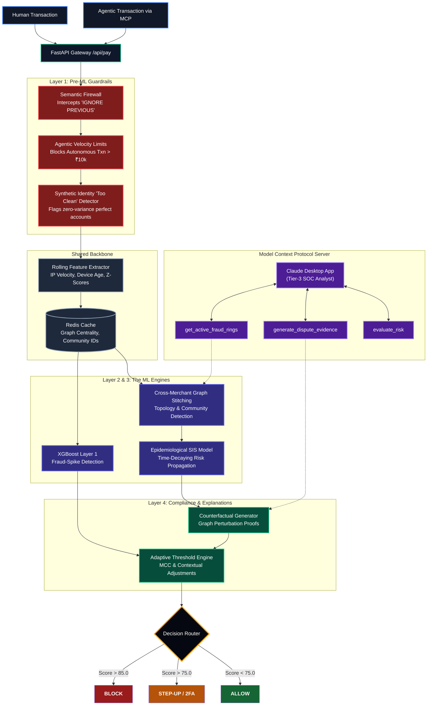

# Abuse-Ring Sentinel
**Zero-Trust AI Security Proxy for Agentic Payments**
> Razorpay AI Buildathon 2026 — AI Risk Manager Track

Abuse-Ring Sentinel intercepts every payment — human or AI-agent-initiated — before it reaches the payment API, running it through four defensive layers in under 100ms. Modern fraud rings spread mule accounts across multiple merchants specifically to stay under any single merchant's radar; this system is built around the idea that only an aggregator (like Razorpay, sitting across many merchants) can see the full ring.

## The Plain-English Pitch
**The Problem:** In the future, AI agents (like ChatGPT) will be making purchases and moving money automatically on our behalf. But what happens when a fraudster hacks an AI, or sets up a massive network of bots to steal money? Traditional security systems are built to catch human thieves, not autonomous AI swarms. Furthermore, modern scammers hide by spreading their fake accounts across dozens of different stores. Because each store only sees a tiny piece of the puzzle, the scammers slip right through.

**Our Solution:** We built the **Abuse-Ring Sentinel**. It is a "Zero-Trust" gatekeeper that sits in front of the payment button and acts like a hyper-intelligent security guard. It runs every single transaction through 4 layers of defense in less than a tenth of a second.

## Architecture



### Layer 1 — The Pre-ML Guardrail (Deterministic Trust Boundaries)
Philosophically, this layer is the odd one out—we deliberately *don't* use machine learning for the core decision. When dealing with autonomous AI agents moving real money, safety-critical boundaries need to be deterministic, auditable, and impossible for ML drift to quietly erode over time. It performs three jobs:
* **Synthetic Identity Detector:** Fraudsters generating fake identities at scale use scripts, and scripts are statistically too clean. Instead of hunting for anomalies, we hunt for unnatural perfection (zero variance in purchase timing, robotic regularity). If an account is "too good to be human," it gets flagged.
* **Agentic Velocity Limits:** A hard-coded trust boundary. If an AI agent attempts to move more than ₹10,000 autonomously, it's blocked instantly—no ML in the loop, no exceptions.
* **Semantic Firewall:** Defends against prompt injection, screening incoming transaction metadata for malicious instructions before it reaches Claude's reasoning layer.

### Layer 2 — The Fraud-Spike Detector (XGBoost)
Once a transaction clears the guardrails, it flows into the Fraud-Spike Detector. We engineer rolling, time-windowed features (IP velocity, device age, amount z-scores) to catch brute-force spikes before the slower graph layer finishes updating.
* **Why XGBoost, not a Neural Network?** 
  1. **Speed:** Sub-100ms budget. XGBoost on tabular features is orders of magnitude faster than deep nets.
  2. **Interpretability:** Gradient-boosted trees give us feature importances almost for free, so we can tell regulators exactly which features pushed a score up.
  3. **Tabular Dominance:** Neural nets earn their keep on unstructured data (images/text). On structured, rolling numeric features, tree ensembles consistently match or beat deep learning with far less training data.

### Layer 3 — The Cross-Merchant Graph Aggregator
This is where we catch the coordinated rings that no single merchant could ever see. If a mule ring spreads its accounts across four merchants, each merchant's local model sees clean, unconnected accounts. Because we sit at the aggregator level, we stitch their isolated graphs together using shared hashed identifiers.
* **Why Classical Graph Algorithms (PageRank & Louvain) instead of GraphSAGE?** Regulators don't accept "the neural net said so" as evidence. We use **Louvain** to instantly surface hidden botnet clusters, and **PageRank** to identify the critical "cash-out" nodes connecting them.
* **The Epidemiological SIS Model:** Fraud risk changes over time. We model fraud like a virus (Susceptible-Infected-Susceptible). If a clean account shares a device with a scammer, its risk spikes ("exposed"). If it stays clean, its risk mathematically decays over time. This catches "dormant-then-reactivate" evasion tactics where fraudsters lay low to let their scores naturally reset.

### Layer 4 — Compliance and the Counterfactual Generator
A graph risk score is not legal evidence. "The PageRank was high" doesn't hold up when an account holder appeals. We built a Counterfactual Generator that produces actual evidentiary proof.
* **How it works:** It takes the live graph, literally severs the specific edges connecting the suspect account to high-risk nodes (in memory), and recomputes PageRank. The delta between the original score and this counterfactual score is a precise, deterministic answer to: *"How much of this account's risk exists specifically because it shares a device with known high-risk nodes?"* This is the exact legal justification needed to freeze an account.
* **Adaptive Threshold Engine:** Block thresholds shift based on business context (stricter for high-risk MCCs, extra penalties for Account-Takeover signatures).

## Repo Structure
```text
.
├── backend/
│   ├── app.py                 FastAPI gateway — /api/pay, /api/evaluate_risk, /api/feedback, etc.
│   ├── mcp_server.py          MCP server exposing the system to Claude Desktop
│   ├── evidence_responder.py  Builds chargeback/dispute evidence packets
│   └── redis_client.py        Graph-risk store (Redis with in-memory fallback)
├── data/
│   ├── generate.py            Synthetic transaction + fraud-ring generator
│   └── output/                Generated CSVs (edges, node labels, tabular features)
├── ml/
│   ├── train.py                Trains the XGBoost fraud-spike model
│   └── output/                 model.json, feature_names.json, metrics.json, SHAP/threshold plots
├── graph_engine/
│   ├── build_graph.py          Cross-merchant graph aggregation, epidemic decay, counterfactuals
│   └── output/                 graph_risk_scores.csv
├── frontend/
│   ├── index.html               Landing/overview page
│   ├── dashboard.html           Live transaction + fraud-ring dashboard
│   └── checkout.html            Demo checkout flow that calls /api/pay
├── demo_attack.py               Adversarial evasion demo (cross-merchant mule ring)
├── requirements.txt
├── .env.example
└── README.md
```

## Setup
```bash
git clone <your-repo-url>
cd abuse-ring-sentinel
pip install -r requirements.txt
cp .env.example .env        # fill in Razorpay test keys — never commit real keys
```

## Running the Pipeline
The stages have a real dependency order — each one reads output the previous stage wrote. You can run `./run_all.sh` or run them manually:

```bash
# 1. Generate synthetic transactions + injected fraud rings
python data/generate.py

# 2. Build the cross-merchant graph, compute PageRank/Louvain + epidemic decay + counterfactuals
python graph_engine/build_graph.py

# 3. Train the XGBoost fraud-spike model on the generated tabular features
python ml/train.py

# 4. Start the API (loads model.json + graph_risk_scores.csv on startup)
uvicorn backend.app:app --reload --port 8000
```
*Optional — run the adversarial evasion demo against a live server:*
```bash
python demo_attack.py
```
Open `frontend/dashboard.html` to watch transactions and ring alerts stream in via the `/ws/feed` WebSocket.

## MCP Server (Claude Desktop Integration)
`backend/mcp_server.py` exposes the system to Claude Desktop as a Tier-3 SOC analyst via 7 tools:
* `process_payment`: Execute a payment on the user's behalf (subject to all 4 layers)
* `evaluate_risk`: Pre-auth risk check without moving money
* `generate_dispute_evidence`: Generate a chargeback evidence packet for a transaction
* `get_recent_transactions`: Pull the live audit trail
* `get_active_fraud_rings`: Query currently detected rings/clusters
* `submit_fraud_feedback`: Confirm ground-truth label for a past transaction
* `trigger_model_retraining`: Kick off incremental XGBoost retraining

Run it with `python backend/mcp_server.py` and point Claude Desktop's MCP config at it.

## Model Performance
Evaluated on a strict chronological 30% test split:
* **Precision:** 0.591
* **Recall:** 1.000
* **F1 Score:** 0.743
* **AUC-PR:** 0.716

*Cost-sensitive analysis (AOV ₹2,500, 10% margin, ₹500 LTV-churn penalty per false positive, ₹2,500 chargeback cost per false negative):*
* **False positive cost:** ₹13,500 (18 blocked-legit txns)
* **Fraud prevented:** 26 transactions, ₹65,000
* **Net savings:** ₹51,500

These numbers are intentionally not "too good to be true" — recall is prioritized (catch every fraud case) at the cost of some false positives.

## Known Limitations & Security Notes
* **Graph layer uses classical centrality, not a GNN.** `build_graph.py` computes PageRank + Louvain community detection, not GraphSAGE.
* **Epidemic decay** falls back to a simplified constant for users with no transaction history in the current dataset window, rather than a true per-neighbor exposure timeline.
* **Security:** Never commit real API keys. If you cloned this after a prior version had hardcoded test keys in `app.py`, those keys have already been exposed and should be rotated.
